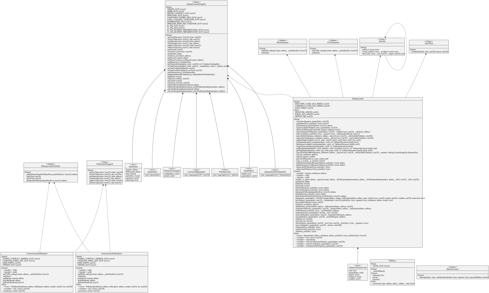

# 🥩

# Summary

The Staking Contracts allows the registered node operators to deposit validator keys that are funded by external users. This allows a seemless staking experience for end users, enabling them to stake one or several validators with one transaction.

# Dependencies

## Node Modules

Install all required Node dependencies by running `yarn`

## Foundry

[Foundry](https://github.com/foundry-rs/foundry) is used to manage the contracts source code and tests. Install it by following the instructions and make sure that `forge` and `cast` are available commands.

# Commands

## Compile

All sources can be built by running `forge build`

## Tests

You can run all the test suite by running `forge test`. Increase verbosity with `forge test -vvv` to retrieve complete error stack traces.
To run only one test file, you can run `forge test -vvv --match-contract StakingContractTest` which is the name of the contract you can find in the `StakingContract.t.sol` test file.

# Deployment

You will find all the steps to properly deploy and populate the system. You will find several `VARIABLES` that you will need to make sure are properly setup according to the instructions. They will be referenced by using the `$VARIABLE` syntax in the required commands.

## I. Pre-Deployment Steps

### Prepare System Administrator (`SYSTEM_ADMIN`)

The system administrator address will be in charge of all the admin operations in the all the system, like changing the administrator or the operator address.

#### Gnosis Safe

If you want to share the administration between several recipients, you can deploy a Gnosis Safe contract and configure its threshold as you please. The easiest way to deploy a Gnosis Safe is to use the official [Gnosis Safe App](https://gnosis-safe.io/app) and follow the instructions to setup the initial members and threshold.

### Prepare Implementation Administrator (`IMPLEMENTATION_ADMIN`)

The system is composed of several upgradeable contracts. These contracts work by using a proxy that is following the transparent proxy pattern. This simply means that the administrator of the proxies cannot call functions on the system like a regular wallet and is bound to the proxy methods. This is useful when you want to make sure there are no collisions between method names in the proxy and in the implementation. The Implementation Administrator is the account in charge to orchestrating implementation upgrades.

#### Gnosis Safe

If you want to share the implementation administration between several recipients, you can deploy a Gnosis Safe contract and configure its threshold as you please. The easiest way to deploy a Gnosis Safe is to use the official [Gnosis Safe App](https://gnosis-safe.io/app) and follow the instructions to setup the initial members and threshold.

This is not the same gnosis safe account as the system administrator, it needs to have a different address.

### Prepare Operator(s) (`OPERATOR`)

This/these account(s) will be in charge of adding keys to the system. They have to be handled by the Node Operator that manages the validator infrastructure.

## II. Deployment Steps

### Deployment Variables

These environment variables are required for the deployment command.

#### Deploying Accounts (`MNEMONIC`)

You will need a mnemonic phrase pointing to a funded account on the deployment network. This account won't have any ownership or extra rights upon the system, losing this key will no represent a threat for the system (still, don't lose your keys)

#### Ethereum RPC Endpoint (`RPC_URL`)

You will need an RPC endpoint on the deployment network. You can use a service like Infura, Alchemy or your own node.

#### Network (`NETWORK`)

The name of the network you are deploying to. Can be one of:
- `goerli`

#### Deposit Contract (`DEPOSIT_CONTRACT`)

You will need to have the address of the official Deposit Contract available on your deployment network.

### Configuration Variables

These configuration variables are required to be properly set for the deployment. The variable naming is `file:path = value`

- `hardhat.config.ts`:`namedAccounts.admin.$NETWORK` = `$SYSTEM_ADMIN`
- `hardhat.config.ts`:`namedAccounts.proxyAdmin.$NETWORK` = `$PROXY_ADMIN`
- `hardhat.config.ts`:`namedAccounts.operator.$NETWORK` = `$OPERATOR`
- `hardhat.config.ts`:`namedAccounts.depositContract.$NETWORK` = `$DEPOSIT_CONTRACT`

### Deployment Command

To start the deployment process, run this command by replacing the variables with the values gathered in the steps above and making sure that configuration file values are set properly.

`env MNEMONIC=$MNEMONIC RPC_URL=$RPC_URL yarn hh deploy --network $NETWORK`

## III. Testnet Post Deployment Steps

### Add Operator as `SYSTEM_ADMIN`

The method to call on the `StakingContract` to add a node operator is `function addOperator(address _operatorAddress)` from the system administrator account.

This command is intended for testnet only purposes. In production, it is expected from the system administrator to properly submit transactions from the multisig account.

You will need to prepare the following variable before sending the call

- `OPERATOR_ADDRESS`: Address of a node operator
- `STAKING_CONTRACT_ADDRESS`: Address of the deployed staking contract
- `RPC_URL`: Ethereum RPC endpoint on the deployment network
- `MNEMONIC_FILE`: A file containing the system administrator mnemonic wallet (testnet only !)

Run

`cast send --mnemonic-path $MNEMONIC_FILE $STAKING_CONTRACT_ADDRESS "addOperator(address)" $OPERATOR_ADDRESS`

### Set Operator staking limit as `SYSTEM_ADMIN`

The method to call on the `StakingContract` to set a node operator staking limit is `function setOperatorLimit(uint256 _operatorIndex, uint256 _limit)` from the system administrator account.

This command is intended for testnet only purposes. In production, it is expected from the system administrator to properly submit transactions from the multisig account.

You will need to prepare the following variable before sending the call

- `OPERATOR_INDEX`: Index of a registered node operator
- `STAKING_LIMIT`: The maximum amount of funded validators the node operator can have
- `STAKING_CONTRACT_ADDRESS`: Address of the deployed staking contract
- `RPC_URL`: Ethereum RPC endpoint on the deployment network
- `MNEMONIC_FILE`: A file containing the system administrator mnemonic wallet (testnet only !)

Run

`cast send --mnemonic-path $MNEMONIC_FILE $STAKING_CONTRACT_ADDRESS "setOperatorLimit(uint256,uint256)" $OPERATOR_INDEX` `$STAKING_LIMIT`

### Add Validator Keys as `OPERATOR`

The method to call on the `StakingContract` to add new validator keys is `function addValidators(uint256 _operatorIndex, uint256 _keyCount, bytes calldata _publicKeys, bytes calldata _signatures)` from the node operator account registered at index `_operatorIndex`.

This command is intended for testnet only purposes. In production, it is expected from the operator to properly submit keys from its infrastructure and making sure the operator wallet is stored in the adequate hardware or service. This solution is mainly meant to quickly populate the contract.

You will need to prepare the following variable before sending the call

- `PUBLIC_KEYS`: Concatenate your public keys.
- `SIGNATURES`: Concatenate your signatures. Make sure the signature for a public key is at the same index in the concatenation as its associated public key.
- `KEY_COUNT`: Total count of keys
- `STAKING_CONTRACT_ADDRESS`: Address of the deployed staking contract
- `RPC_URL`: Ethereum RPC endpoint on the deployment network
- `MNEMONIC_FILE`: A file containing the operator mnemonic key
- `OPERATOR_INDEX`: The index of the operator

Run

`cast send --mnemonic-path $MNEMONIC_FILE $STAKING_CONTRACT_ADDRESS "addValidators(uint256,uint256,bytes,bytes)" $OPERATOR_INDEX $KEY_COUNT $PUBLIC_KEYS $SIGNATURES`

# Upgrade

The upgrade process consists in deploying a new implementation contract and changing the implementation pointed by the corresponding Proxy. In production, this upgrade will be proposed as a multisig signature and all involved parties will be able to see what is the new implementation address for the target proxy.

## Upgrade method

To upgrade a proxy, you can call `upgradeTo(address)` or `upgradeToAndCall(address,bytes)` with the implementation admin multisig.

## Upgrade checksum

To make sure the upgrade is actually pointing to a contract implementation of a smart contract code that all parties have agreed upon, we can reproduce these steps locally.

### I. Getting implementation bytecode

To retrieve the implementation bytecode, you have to compile the contracts locally. In the following example, we assume that the upgrade is for the `StakingContract` contract.

To compile everything, run `forge build`
To retrieve the bytecode, run `cat out/StakingContract.sol/StakingContract.json | jq .deployedBytecode.object`

### II. Getting live bytecode

To retrieve the implementation bytecode that is currently deployed on the network, you will need:

- `RPC_URL`: Ethereum RPC endpoint on the deployment network
- `IMPLEMENTATION_ADDRESS`: Address of the new implementation address

and you can run `cast code --rpc-url $RPC_URL $IMPLEMENTATION_ADDRESS`

You can then compare if the local bytecode and the deployed bytecode are matching.

# Components

Generate by running `yarn docs`

## [Staking Contract](./natspec/StakingContract.md)

The Staking Contract is the main input of the system. Node Operator pre-register batchs of validator keys. End users can send multiples of 32 ETH directly to the contract, and if enough keys are available the validator deposit(s) will occur. Stakers are also able to define Withdrawer accounts, an account that is allow to withdraw the funds and the collected fees. This allows them to not only specify a different address than the one they use for deposits but also to change this account in the future.

### Fee Recipients

There are two types of fee recipients that can be deployed by the `StakingContract`:
- the Execution Layer fee recipient
- the Consensus Layer fee recipient

Each validator public key has two unique fee recipients. We are using the `CREATE2` instruction in order to perform a deterministic and state agnostic deployment for both of these fee recipients. What this means is that the address of these recipients can be computed before they are deployed by the `StakingContract` and they can also start receiving fees / withdrawals before they are deployed. Users can then ask for withdrawals and the fee recipients will be deployed only at this point, allowing the system to take a fee given to the node operator. Node operators can also trigger withdrawals in behalf of their users to actively collect fees when required.

## [Minimal Receiver](./natspec/MinimalReceiver.md)

This Contract is deployed as the implementation for minimal proxy clones used to gather the fees from the Execution Layer or the Consensus Layer. One clone will be deployed per public key at a deterministic address. It is required from node operators to compute this address and use it as the execution client `feeRecipient` for the blocks proposed by the validator identified by the public key. This receiver will then forward its balancer to an upgradeable dispatcher, in charge of splitting the funds.

### Computing the Execution Layer Fee Recipient address for a specific public key

As the recipient address is deterministic, we can compute this address before publishing the key to the contract. 

To compute this address, call `function getELFeeRecipient(bytes calldata _publicKey) view` on the `StakingContract`.

### Computing the Consensus Layer Fee Recipient address for a specific public key

As the recipient address is deterministic, we can compute this address before publishing the key to the contract. 

To compute this address, call `function getCLFeeRecipient(bytes calldata _publicKey) view` on the `StakingContract`.

